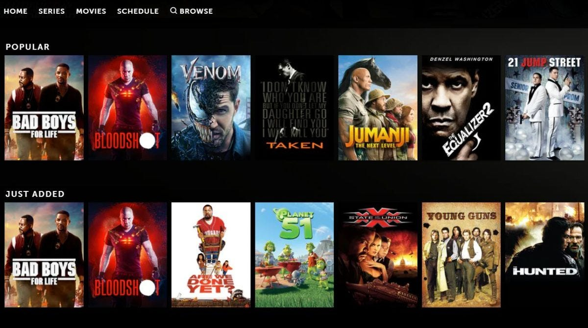

# Hybrid Movie Recommendation System

A comprehensive movie recommendation system combining genre-based, content-based, and collaborative filtering techniques to deliver accurate, diverse, and personalized recommendations.

## Motivation

With the vast amount of digital content on streaming platforms, users face information overload. This project aims to improve recommendation accuracy and diversity by integrating multiple recommendation methods, enhancing user experience and personalization.

## Overview

The system integrates three main approaches:

- **Genre-Based Recommendations:** Uses the Apriori algorithm to uncover frequent genre associations and weighted rating systems to prioritize popular and highly-rated movies.
- **Content-Based Filtering:** Employs clustering algorithms (K-Means, DBSCAN, Hierarchical) on movie metadata to group similar movies.
- **Collaborative Filtering:** Implements K-Nearest Neighbors (KNN) to predict user preferences based on rating patterns.

By combining these, the hybrid model balances accuracy, personalization, and diversity.

## Dataset

- MovieLens dataset with over 45,000 movies and 270,000 users.  
- Includes rich metadata such as genres, cast, budget, revenue, and user ratings on a 1–5 scale.

## Methodology

- **Data Cleaning & Preprocessing:** Handled missing values, duplicates, outliers, and standardized data formats.  
- **Feature Engineering:** One-hot encoding of genres, weighted rating calculations, TF-IDF vectorization of plot summaries, and user preference features.  
- **Clustering:** Applied K-Means, DBSCAN, and Hierarchical clustering on movie features.  
- **Collaborative Filtering:** Used user-based KNN with cosine similarity.  
- **Hybrid Integration:** Combined outputs from genre analysis, content clustering, and collaborative filtering to generate recommendations.

## Results

| Approach                           | Metric                        | Value    |
|------------------------------------|-------------------------------|----------|
| Genre-Based                        | Precision@5                   | 0.60     |
|                                    | Recall@5                      | 1.00     |
|                                    | F1 Score@5                    | 0.75     |
| Collaborative Filtering            | RMSE (Cross-Validation)       | 0.9943   |
|                                    | MAE (Cross-Validation)        | 0.7675   |
| Hybrid System                      | Diversity Score               | 1.00     |

The hybrid system delivers a good balance of recommendation accuracy and variety.

## Future Work

- Integrate deep learning methods like Autoencoders and Neural Collaborative Filtering for improved accuracy.  
- Incorporate context-aware recommendations using time, location, and device data.  
- Apply sentiment analysis on user reviews to refine predictions.  
- Improve scalability with distributed computing and parallel processing.
